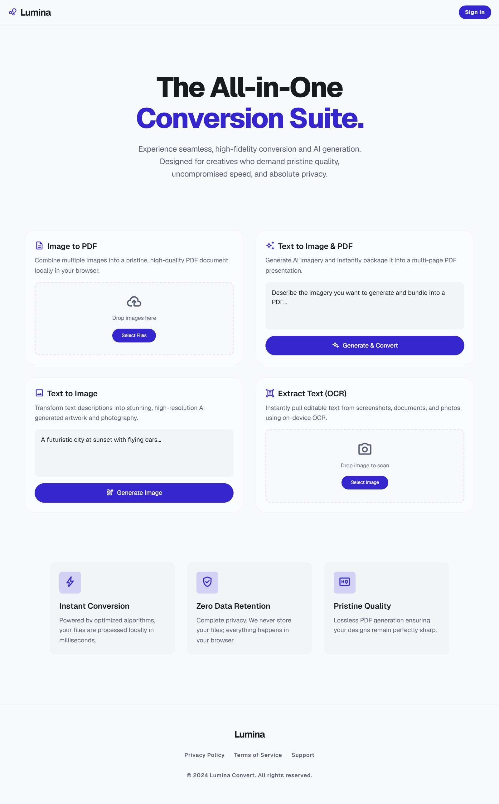

# Lumina Convert

Lumina Convert is a premium, client-side web utility suite designed for creators, legal professionals, and designers who value speed, privacy, and aesthetic clarity. The application operates entirely inside the browser sandbox, processing all files locally without uploading user data to any external server.

## Core Features

1. **Image to PDF Compiler (Offline)**
   - Drag-and-drop or select multiple images (JPEG, PNG, WEBP).
   - Live preview queue with custom reordering (Move Up/Down), rotation (90° clockwise canvas-based processing), and file deletion.
   - Adjust paper size (Fit Image, A4, US Letter), orientation (Portrait/Landscape), margins (None, Small, Medium), and fit modes (Contain/Cover).
   - Generates high-fidelity PDF documents instantly using `jsPDF`.

2. **Text to Image Generator (AI)**
   - Hooked directly to a public, high-speed diffusion modeling API (Pollinations AI).
   - Supports adjustable aspect ratios (Square 1:1, Landscape 16:9, Portrait 9:16) and premium art style presets (Photorealistic, Vibrant Digital Art, Cyberpunk, Anime, Cinematic Oil Painting).
   - Supports downloading rendered artwork, copying direct URLs, and sending generated images straight to the PDF compilation queue.

3. **Text to Image & PDF Presentation Maker (AI)**
   - Generates sequential multi-page illustrations based on narrative storytelling prompts.
   - Automatically splits and generates custom visual slides using the diffusion engine.
   - Compiles slides into a clean landscape PDF presentation containing page numbers and styled page footers.

4. **Extract Text (OCR - Local WebAssembly)**
   - Extracts editable plain text from photos, scans, screenshots, and documents.
   - Runs locally in the browser using the `Tesseract.js` WebAssembly port.
   - Features a real-time progress bar indicating the exact recognition stages.
   - Enables copying text to the clipboard and downloading the extracted text as a `.txt` file.

5. **Premium Aesthetic & UX**
   - Airy, editorial layout inspired by luminous whiteboard platforms.
   - Complete Light and Dark mode mapping using CSS variables and Tailwind class toggles.
   - Interactive glassmorphic modal overlays, custom scrollbars, and a responsive Toast alert notification banner.

## Privacy Architecture

Lumina Convert prioritizes zero data retention:
- **PDF Compilation:** Performed entirely on your browser canvas. No image is ever sent to a server.
- **OCR Text Extraction:** Processed entirely on-device via local WebAssembly threads using Tesseract.js.
- **AI Visual Generation:** Runs client-to-API calls. Note that prompt variables are sent to the public diffusion API. Do not input passwords or highly sensitive personal data into generation prompts.

## Getting Started

Because the application is built entirely as a client-side Single Page Application (SPA), it requires **zero installation or backend servers**.

### 1. Run Locally
Simply double-click the [index.html](index.html) file to open it in Chrome, Edge, Firefox, or Safari.

### 2. Local Host
If you prefer running it from a local server port, execute one of the following commands in the folder:
- **Python 3:** `python -m http.server 8000`
- **Node.js:** `npx serve` (requires Node)

Then navigate to `http://localhost:8000` in your web browser.
